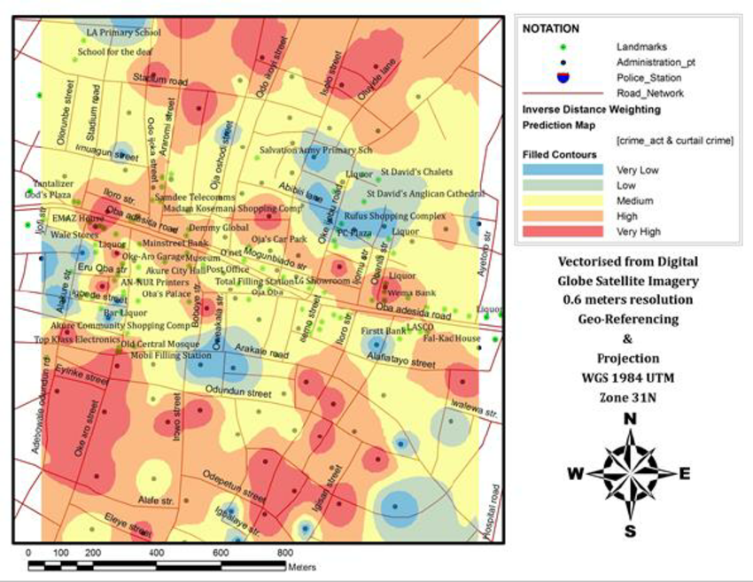
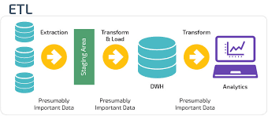

# SF-Evicition Tracking Using Python And MySql

<!-- PROJECT LOGO -->
 

    
  </a>

  <h2 align="center"><b><u>SF-Evicition Tracking</u></b></h2>

  

    Visualize And Analyze Eviciton_Data in the San Franscisco Bay Area.A brute forcing approach to understanding the working of data warehouses and its applications.
     
  

<!-- TABLE OF CONTENTS -->

  
Table of Contents

  <ol>
    <li>
      <a href="#about-the-project">About The Project</a>
      <ul>
        <li><a href="#built-with">Built With</a></li>
      </ul>
    </li>
    <li><a href="#architecture">Architecture</a></li>
    <li><a href="#data_model">Data Model</a></li>
    <li><a href="#etl_flow">ETL Flow</a></li>
  </ol>

<!-- ABOUT THE PROJECT -->
<h2 align="center"><u>About The Project</u></h2>

Tracking eviction trends in San Francisco across filing reasons, districts, neighborhoods, and demographics across years. Data warehouse infrastructure is MySQL Server and uses python and its libraries for orchestration with visualisation notebooks.The project aims at providing real-worl-evidence to the application of data warehouses from the etl-stage to gaining insights from the data.

### Built With

The major frameworks and libraries used in the project -
* [MySQL Server](https://www.mysql.com/)
* [Python](https://www.python.org/)
* [Pandas](https://pandas.pydata.org/)
* [MatplotLib](https://matplotlib.org/)
* [Seaborn](https://seaborn.pydata.org/)
* [SQL](https://en.wikipedia.org/wiki/SQL)

<!-- Architecture -->
<h2 align="center"><u>Architecture</u></h2>

Data is sourced from San Francisco Open Data's csv's containing San Francisco eviction_data. Python scripts orchestrates its movement to an MySQL Server DB as data warehouse. SQL scripts are then ran to transform the data from its raw form through a staging schema and into production target tables. The presentation layer is created using jupyter notebook,seaborn and matplotlib as visualisation libraries.
 
<!-- Data Model -->
<h2 align="center"><u>Data Model</u></h2>
The data model is implemented using a star schema - the dimension tables are directly connected to the fact table.The Schema of the data warehouse model is as follows - 

1) Dimension Tables: dim_district,dim_neighborhood,dim_location ,dim_mod_reason,dim_date

2) Fact Tables: fact_evictions

<!-- ETL Flow -->
<h2 align="center"><u>ETL Flow</u></h2>
General Overview -
  Evictions data is collected from the SODA API/csv and moved into an MYSql Server "raw_db" schema and moves through a staging schema for processing and transforming the raw data to dimension and fact tables.ETL job execution is complete once data is moved from the staging schema into the final production tables,where the queries can be executed and insights can be generated.

Process Flow with Modules to run - 

Extract - 

1) Get Data from source systems - get_data.py
2) Store the Extracted Data to raw schema - load_raw.py

Transform -

1) Create The staging and production schema - load_staging.py and   load_prod.py
2) Transform raw_data to dimension and fact format - engine.py and sql_scripts

Load - 

1) Load the transformed data from staging to prod - full_load_prod.sql

Visualise - 

1) Run Queries and generate visualisation in - visualisation_nb.ipynb

<!-- ACKNOWLEDGEMENTS -->
<h2 align="center"><u>Acknowledgements</u></h2>

* [SF_Eviciton_Tracking](https://github.com/ilya-galperin/SF-EvictionTracker)
* [Mr. Alan Simon For His Insightful Course - Data Warehouse Fundamentals for Beginners](https://www.udemy.com/course/data-warehouse-fundamentals-for-beginners/)
* [Github](www.github.com)

